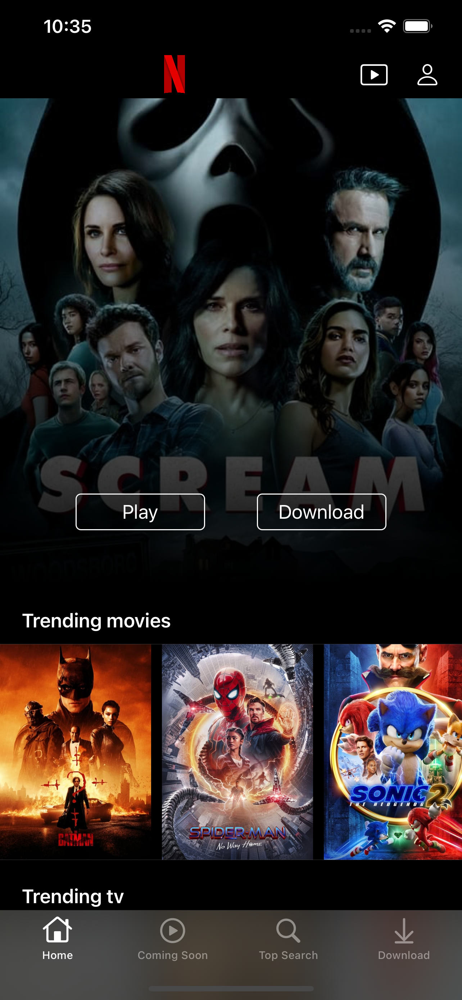
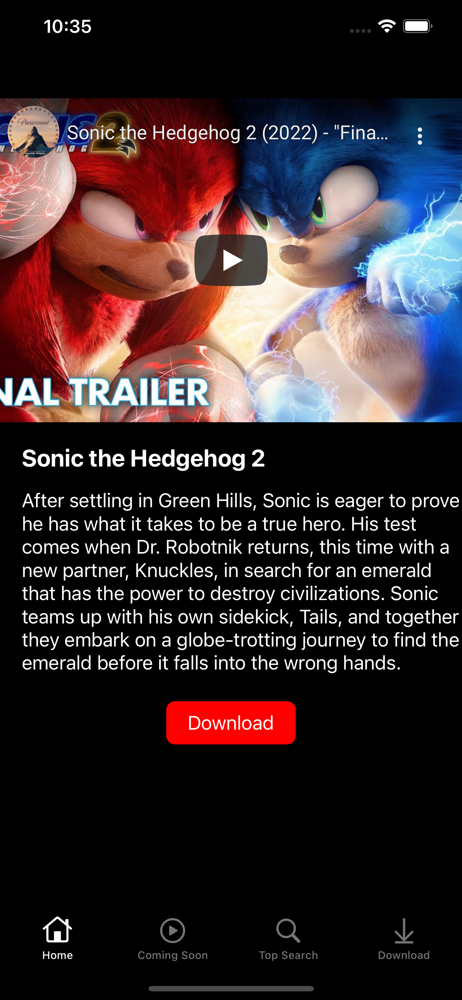
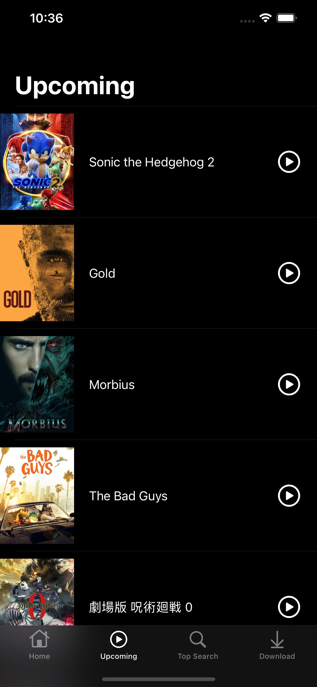
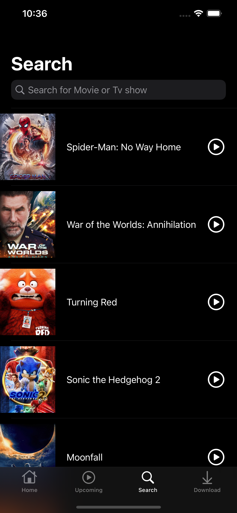
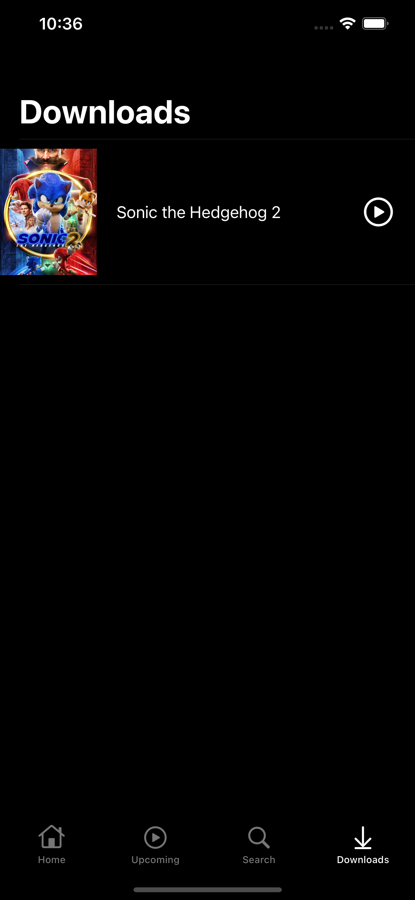

# Netflix-Clone
## Getting Started ##

1. git clone https://github.com/singhbaidwan/Netflix-Clone  
2. cd Netflix-Clone. 
3. Open Music.xcworkspace in Xcode 8.0 or higher. 
4. Visit [TMDB](https://www.themoviedb.org) website to register yourself and get API KEY. 
5. Visit Google Cloud , create a new project and then click on create credential and add Youtube data API to get api key for fetching youtube videos. 
6. After Getting API Keys copy TMDB api key to Constant.API_KEY and google API key to Constant.YouTubeAPI_KEY . 
## Screenshots ##

<table>
<tr>
<td></td>
<td> </td>
<td></td>
</tr>
<tr>
<td></td>
<td> </td>
<td></td>
</tr>
<tr>
<td></td>
<td> </td>
</tr>

</table>

